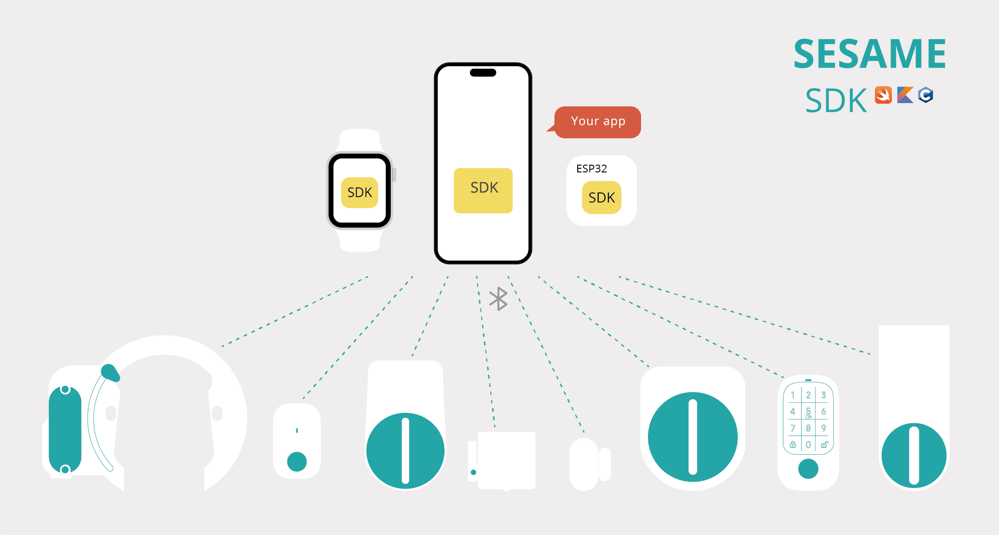

# ESP32-C3-DevKitM-1によるセサミ5の操作例

このプロジェクトでは、ESP32-C3-DevKitM-1マイクロコントローラを使用してセサミ5スマートロックを登録および操作する方法を示します。この例では、ESP-IDF開発フレームワークとBLE技術を利用して、近くのセサミ5デバイスを自動的に探索し、接続して登録します。ESP32-C3-DevKitM-1がセサミ5が解錠位置に達したことを検出すると、自動的にロックするコマンドを発行します。

## 多言語バージョン
- [繁體中文版](README.md)
- [English version](README_EN.md)

## 前提条件
ESP-IDFをインストールする必要があります。これは、ESP-IDFの`install.sh`スクリプトを使用して必要なツールチェーンと依存関係をインストールすることで行えます。

## インストールと環境設定
1. ESP-IDFの`install.sh`を通じてツールチェーンがインストールされていることを確認してください。
2. ターミナルを開いて、ESP-IDFのパスに移動し、`export.sh`を実行して環境変数に追加します。
3. ESP32-C3-DevKitM-1をUSBでコンピュータに接続します。
4. プロジェクトフォルダに戻り、`idf.py flash`を実行してコンパイルとフラッシュを行います。

## 使用方法
ESP32-C3-DevKitM-1にファームウェアを焼いて再起動した後、近くの未登録のSesameデバイスを自動的に検索します。接続して登録した後、ESP32-C3-DevKitM-1はSesame5の状態を監視し、適切なタイミングでロックコマンドを発行します。

## 特徴と機能

- **自動デバイス探索**: 近くのセサミ5スマートロックを自動的に探索して接続します。
- **自動ロック**: セサミ5が予定の解錠位置に達したときに、ESP32-C3-DevKitM-1が自動的にロック指令を発行します。

## ソースコードの参照

この例は、ESP-IDF内のnimble BLE Central Exampleを基に改良されました。

## 追加リソース

- セサミ5スマートロックに関する詳細は、[CANDY HOUSE公式ウェブサイト](https://jp.candyhouse.co/)をご覧ください。

## ライセンス

このプロジェクトはMITライセンスのもとで公開されています。詳細は`LICENSE`ファイルをご覧ください。

## 謝辞

このプロジェクトにご興味を持っていただき、オープンソースリソースに対するCANDY HOUSE社のサポートに感謝します。
